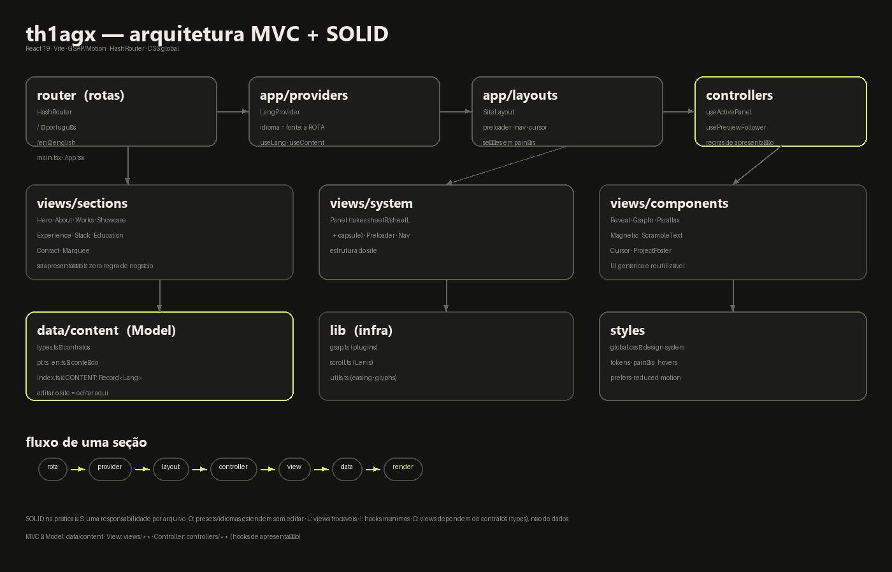

# Thiago Antunes — Portfólio

Portfólio de engenheiro de software construído como um filme: **câmera parada, conteúdo transitando**. Seções inteiras entram deslizando lateralmente, o texto acende palavra por palavra e o carregamento é um objeto único girando. Bilíngue por rota (PT/EN), UI movida a GSAP + Motion, tipografia Bricolage Grotesque × Fraunces.



## Links

- **Produção**: https://thiagoantunes.com
- **Espelho**: https://th1agx.github.io/Portifolio_ThiagoAntunes
- **Repos dos projetos**: cada trabalho da lista aponta para o GitHub real

## Stack

| Camada | Escolha |
| --- | --- |
| Build | Vite 7 + TypeScript strict |
| UI | React 19 |
| Animação | GSAP 3 (SplitText, ScrollTrigger) + Motion (motion/react) |
| Scroll | Lenis (smooth, autoRaf) |
| Rotas | react-router (HashRouter — funciona em qualquer host estático) |
| Fontes | @fontsource self-hosted (Bricolage Grotesque Variable, Fraunces italic) |
| Estilo | CSS global único com design tokens |

## Arquitetura — MVC + SOLID

```
src/
├── main.tsx                 # entry: HashRouter + fontes + CSS global
├── App.tsx                  # rotas: / (pt) e /en (en)
├── app/
│   ├── providers/
│   │   └── LangProvider.tsx # idioma pela ROTA; useLang/useContent
│   └── layouts/
│       └── SiteLayout.tsx   # preloader → nav/cursor → seções em painéis
├── controllers/             # regras de apresentação (hooks)
│   ├── useActivePanel.ts    # qual painel cobre o topo (tinta do nav)
│   └── usePreviewFollower.ts# springs do pôster que persegue o cursor
├── views/
│   ├── components/          # UI genérica: Reveal, GsapIn, Parallax,
│   │                        # Magnetic, ScrambleText, Cursor, ProjectPoster
│   ├── sections/            # Hero, About, Works, Showcase, Experience,
│   │                        # Stack, Education, Contact, Marquee
│   └── system/              # Panel (takes), Preloader, Nav
├── data/
│   └── content/             # MODEL — única fonte de texto
│       ├── types.ts         # contratos (Project, Xp, Content...)
│       ├── pt.ts / en.ts    # conteúdo por idioma
│       └── index.ts         # CONTENT: Record<Lang, Content>
├── lib/                     # infra: gsap.ts, scroll.ts (Lenis), utils.ts
└── styles/
    └── global.css           # design system completo (tokens → componentes)
```

### Como o MVC mapeia

- **Model** → `data/content`: tipos + conteúdo por idioma. Editar o site é editar `pt.ts`/`en.ts`.
- **View** → `views/**`: só apresentação; nenhuma view conhece detalhes de scroll/estado global além dos hooks.
- **Controller** → `controllers/**`: hooks que traduzem o mundo (scroll, DOM) em decisões de UI (ex.: tinta do nav, perseguição do cursor).

### SOLID na prática

- **S** — uma responsabilidade por arquivo: `GsapIn` só entra, `useActivePanel` só detecta, `Panel` só transiciona.
- **O** — aberto a extensão: novo idioma = novo arquivo em `data/content` + 1 entrada no `Record`; novo preset de animação = 1 objeto no mapa do `GsapIn`.
- **L** — views são trocáveis: qualquer seção pode ser remontada no `SiteLayout` sem efeitos colaterais.
- **I** — hooks pequenos e focados (`useContent` devolve só o que se pede).
- **D** — views dependem de contratos (`types.ts`) e providers, nunca de dados acoplados.

## Sistema de design

- **Paleta**: grafite `#131412` (base) · chalk `#EDEDE8` · lime `#D7F452` (acento) · ink `#141410/#EFEDE6`.
- **Transições de seção**: painéis sticky — chalk entra em **take da direita**, graphite **da esquerda**, finale lime em **cápsula que cresce**; a seção anterior vira moldura durante a travessia.
- **Tipografia**: Bricolage Grotesque (display/400–800) × Fraunces itálico (acentos serif).
- **Motion**: `prefers-reduced-motion` respeitado em tudo (GSAP e Motion).
- **Identidade**: logo monocromática via CSS mask (lime sobre escuro, preta sobre claro), favicon = marca do círculo.

## Scripts

```bash
npm install      # dependências
npm run dev      # dev server
npm run build    # typecheck + build de produção em dist/
npm run preview  # serve o build
```

## Deploy

Push no `main` dispara a Vercel (domínio próprio) e o `gh-pages` é atualizado com o build — ambos servem o mesmo bundle. Fluxo: commit em `develop` → merge `--no-ff` em `main` → deploy automático.

---

© 2026 Thiago Antunes · [GitHub](https://github.com/th1agx) · [LinkedIn](https://www.linkedin.com/in/thiagofilipeantunes)
